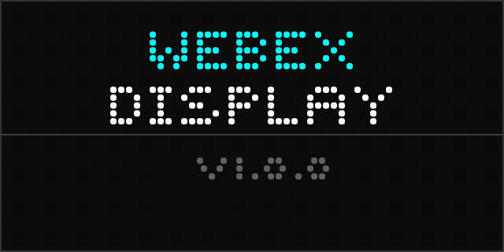
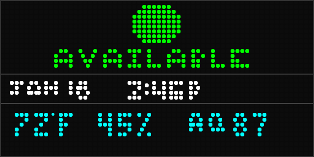
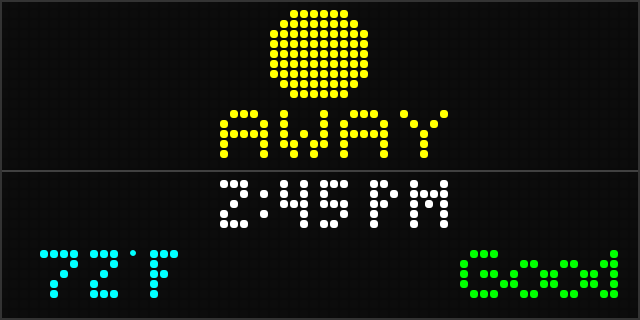
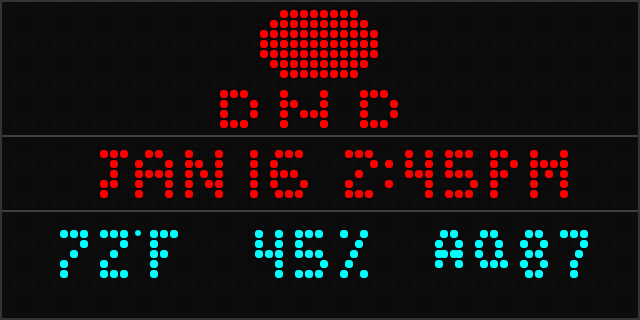

# LED Matrix Webex Status Display

An ESP32-S3 powered 64x32 RGB LED matrix display that shows your Webex presence status at a glance. Perfect for home offices, meeting rooms, or anywhere you want colleagues and family to know your availability without interrupting you.

## Overview

This project creates a physical "busy light" that automatically syncs with your Webex status. When you're in a meeting, the display shows red. When you're available, it's green. It can also display camera/microphone state during calls and environmental sensor data from Cisco Meraki MT sensors.

### Key Capabilities

- **Automatic Status Sync**: Connects to Webex APIs to fetch your real-time presence
- **Visual at a Glance**: Color-coded status visible from across the room
- **Call Awareness**: Shows when your camera is on or microphone is muted
- **Environmental Monitoring**: Optional integration with Meraki MT sensors for temperature, humidity, door status, and air quality
- **Zero Touch Updates**: OTA firmware updates from GitHub Releases
- **Easy Setup**: Web-based configuration portal

## Display States

The 64x32 pixel LED matrix (192mm x 96mm, 3mm pitch, 2048 individual RGB LEDs) displays different screens based on the current state. Each status screen shows the current time, temperature, and air quality.

### Startup Screen

When the device powers on, it shows the startup screen with version information:



### Status: Available

Green circle indicates you're available and ready to communicate. The date and time are displayed in the status color, with temperature, humidity, and air quality index at the bottom:



### Status: Away

Yellow circle shows you're temporarily away from your desk:



### Status: Do Not Disturb

Red circle signals you should not be interrupted. Full text "DO NOT DISTURB" is displayed:



### Status: In A Call

During calls, the display shows "IN A CALL" along with camera and microphone icons. Green camera with "ON" means video is active; red mic with slash and "OFF" indicates audio is muted:


All status screens display environmental data from Meraki MT sensors at the bottom:
- **Temperature**: Displayed in Fahrenheit (e.g., 72°F)
- **Humidity**: Displayed as percentage (e.g., 45%)
- **Air Quality**: Displayed as AQ index number (e.g., AQ 87) - higher is better, 0-50 poor, 51-100 moderate, 100+ good

## How It Works

```
┌─────────────────────────────────────────────────────────────────────────────┐
│                              DATA FLOW                                       │
└─────────────────────────────────────────────────────────────────────────────┘

  ┌──────────────┐         ┌──────────────┐         ┌──────────────┐
  │ Webex Cloud  │         │ Node.js      │         │ ESP32-S3     │
  │              │  WS/API │ Bridge       │  HTTP   │ Firmware     │
  │ - People API ├────────►│              ├────────►│              │
  │ - xAPI       │         │ - Webex SDK  │         │ - Display    │
  │ - Mercury    │         │ - WebSocket  │         │ - Web Server │
  └──────────────┘         └──────────────┘         └──────┬───────┘
                                                           │
  ┌──────────────┐                                         │
  │ Meraki Cloud │         ┌──────────────┐                │
  │              │  MQTT   │ MQTT Broker  │    MQTT        │
  │ - MT Sensors ├────────►│              ├────────────────┤
  │ - Webhooks   │         │              │                │
  └──────────────┘         └──────────────┘                ▼
                                                   ┌──────────────┐
                                                   │ 64x32 RGB    │
                                                   │ LED Matrix   │
                                                   │ HUB75        │
                                                   └──────────────┘
```

### Data Sources

The display can receive status updates from multiple sources:

| Method | Description | Latency | Use Case |
|--------|-------------|---------|----------|
| **REST Polling** | Direct API calls to Webex | 20-120s | Simple setup, fallback |
| **xAPI WebSocket** | Real-time events from RoomOS | ~1s | Cisco video devices |
| **JS SDK Bridge** | Node.js server with Webex SDK | ~1-2s | Real-time without RoomOS |

### Status Colors

| Status | Color | RGB Value |
|--------|-------|-----------|
| Available | Green | `#00FF00` |
| Away / Inactive | Yellow | `#FFFF00` |
| Do Not Disturb | Red | `#FF0000` |
| In Meeting / Busy | Red | `#FF0000` |
| Out of Office | Purple | `#8000FF` |
| Offline / Unknown | Gray | `#808080` |

## Architecture

```
Led-Matrix-Webex/
├── firmware/               # ESP32-S3 PlatformIO project
│   ├── src/
│   │   ├── display/        # LED matrix driver and icons
│   │   ├── network/        # WiFi, MQTT, HTTP clients
│   │   ├── web/            # Embedded web server
│   │   └── config/         # Configuration management
│   └── data/               # Web UI files (LittleFS)
├── bridge/                 # Node.js bridge server (optional)
│   └── src/                # TypeScript source
└── docs/                   # Documentation
    └── images/             # Display state visualizations
```

## Hardware Requirements

| Component | Specification |
|-----------|---------------|
| Microcontroller | ESP32-S3-DevKitC-1-N8R2 |
| Display | 64x32 RGB LED Matrix Panel (2048 LEDs, 3mm pitch, HUB75 interface) |
| Display Dimensions | 192mm x 96mm |
| Power Supply | 5V 2.5A minimum (matrix consumes up to 12W) |

### Hardware Wiring

Connect the HUB75 matrix to the ESP32-S3 as follows:

| Matrix Pin | ESP32-S3 GPIO | Function |
|------------|---------------|----------|
| R1 | GPIO42 | Red data (upper) |
| G1 | GPIO41 | Green data (upper) |
| B1 | GPIO40 | Blue data (upper) |
| R2 | GPIO38 | Red data (lower) |
| G2 | GPIO39 | Green data (lower) |
| B2 | GPIO37 | Blue data (lower) |
| A | GPIO45 | Row address bit 0 |
| B | GPIO36 | Row address bit 1 |
| C | GPIO48 | Row address bit 2 |
| D | GPIO35 | Row address bit 3 |
| E | GPIO21 | Row address bit 4 |
| CLK | GPIO2 | Clock |
| LAT | GPIO47 | Latch |
| OE | GPIO14 | Output enable |

## Installation

### Option A: Install from Pre-built Release (Recommended)

Download the latest release from [GitHub Releases](https://github.com/liptonj/Led-Matrix-Webex/releases).

**Required files:**
- `bootstrap.bin` - Initial firmware for WiFi setup
- `firmware.bin` - Main application firmware  
- `littlefs.bin` - Web UI filesystem

**Flash using esptool.py:**

```bash
# Install esptool if needed
pip install esptool

# Flash the bootstrap firmware (first time setup)
esptool.py --chip esp32s3 --port /dev/ttyUSB0 --baud 921600 \
    write_flash 0x0 bootstrap.bin

# Or flash the full firmware with filesystem
esptool.py --chip esp32s3 --port /dev/ttyUSB0 --baud 921600 \
    write_flash 0x0 firmware.bin 0x310000 littlefs.bin
```

**Flash using PlatformIO (if installed):**

```bash
# Download and extract the release
unzip firmware-v1.0.0.zip -d firmware-release

# Flash firmware
esptool.py --chip esp32s3 write_flash 0x0 firmware-release/firmware.bin
```

### Option B: Build from Source

```bash
cd firmware
pio run -t upload         # Upload firmware
pio run -t uploadfs       # Upload web UI files
```

## Quick Start

### 1. Configure via Web UI

1. On first boot, the device creates a WiFi access point: `Webex-Display-Setup`
2. Connect to this network with your phone or computer
3. Open `http://192.168.4.1` in your browser
4. Enter your WiFi credentials
5. Configure Webex OAuth settings (see below)
6. (Optional) Configure MQTT for Meraki sensor integration

### 2. Webex Integration Setup

1. Go to [Webex Developer Portal](https://developer.webex.com)
2. Create a new Integration
3. Set redirect URI to: `http://webex-display.local/oauth/callback`
4. Request scopes: `spark:people_read`, `spark:xapi_statuses`
5. Copy your Client ID and Client Secret to the device configuration

### 3. (Optional) Bridge Server

For real-time presence updates without a Cisco RoomOS device (desk phone, room kit, etc.), you need to run the Node.js bridge server.

**What is the bridge?**
- A standalone Node.js application (NOT a Webex plugin)
- Runs on an always-on device: Raspberry Pi, home server, NAS, Docker container, etc.
- Connects to Webex cloud using OAuth to monitor your presence in real-time
- Pushes status updates to the ESP32 over your local network via WebSocket
- Auto-discovered by ESP32 using mDNS (`webex-bridge.local`)

**Quick start:**

```bash
cd bridge
npm install
cp env.example .env
# Edit .env with your Webex OAuth credentials
npm start
```

**Deployment options:**
- **Home Assistant Add-on**: [One-click install](homeassistant-addon/README.md) - easiest if you already run HA
- **Raspberry Pi / Server**: [Bridge Deployment Guide](docs/bridge_deployment.md)
- **Docker**: See deployment guide for Docker instructions

The bridge uses the Webex JavaScript SDK to receive real-time presence updates via Mercury WebSocket and pushes them to the ESP32.

## Configuration Options

The web UI allows configuring:

- **WiFi**: Network credentials
- **Webex**: OAuth client ID/secret, user email to monitor
- **MQTT**: Broker address, credentials, topic subscriptions for Meraki sensors
- **Display**: Brightness, polling interval, timezone

## Meraki MT Sensor Integration

To display environmental data from Cisco Meraki MT sensors:

1. Configure an MQTT broker (e.g., Mosquitto)
2. Set up Meraki Dashboard to publish sensor data via MQTT
3. Configure the ESP32 with MQTT broker details in the web interface
4. Enter the sensor serial number in the device settings to subscribe to that specific sensor's data

Supported sensor data:
- **Temperature**: Displays in Fahrenheit
- **Humidity**: Displays as percentage
- **Door Status**: Open/Closed indicator
- **Air Quality**: Good/Moderate/Poor

## License

MIT License - See LICENSE file for details.
