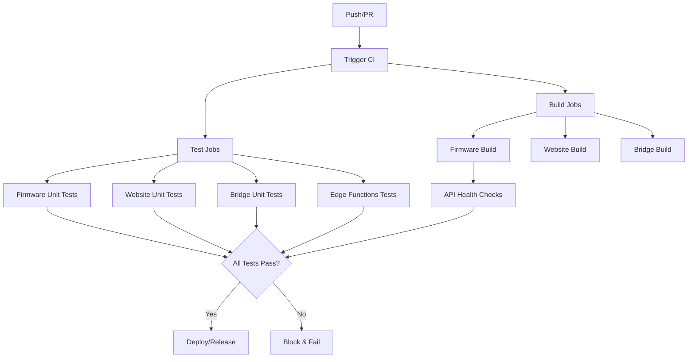

# Testing Guide

This document describes the testing strategy and practices for the LED Matrix Webex project.

## Table of Contents

- [Overview](#overview)
- [Test Categories](#test-categories)
- [Running Tests Locally](#running-tests-locally)
- [CI/CD Test Execution](#cicd-test-execution)
- [Adding New Tests](#adding-new-tests)
- [Debugging Test Failures](#debugging-test-failures)
- [Coverage Requirements](#coverage-requirements)

## Overview

The project has comprehensive test coverage across all major components:

- **69 test files** with ~27,309 lines of test code
- **Firmware**: 8 Unity test files (4,558 lines)
- **Website**: 39 Jest/React Testing Library test files (12,806 lines)
- **Supabase Edge Functions**: 15 Deno test files (5,706 lines)
- **Bridge**: 5 Jest test files (3,997 lines)

All tests run automatically in CI/CD and must pass before any release or deployment.

## Test Categories

### 1. Firmware Tests (Unity Framework)

**Location**: `firmware/test/`

**Framework**: PlatformIO + Unity

**Critical paths tested**:
- Supabase client authentication (HMAC signatures, JWT tokens)
- Webex People API parsing (presence status, user info)
- Realtime subscription handling
- Display data rendering
- MQTT client functionality
- Device credential storage
- Serial command parsing

**Test files**:
- `test_supabase_client/` - Supabase Edge Function client tests
- `test_webex_client/` - Webex People API client tests
- `test_supabase_realtime/` - Realtime subscription tests
- `test_display_data/` - Display data handling tests
- `test_mqtt_client/` - MQTT client tests
- `test_device_credentials/` - Device credential management tests
- `test_serial_commands/` - Serial command parsing tests

### 2. Website Tests (Jest + React Testing Library)

**Location**: `website/src/`

**Framework**: Jest + React Testing Library + Playwright (E2E)

**Critical paths tested**:
- Webex SDK initialization and event handling
- WebSocket reconnection logic
- Admin authentication flows
- Device command operations
- Supabase client integration
- UI component rendering
- React hooks (theme, navigation, async operations)

**Test categories**:
- **Hooks**: `src/hooks/__tests__/` - Custom React hooks
- **Components**: `src/components/**/__tests__/` - UI components
- **Libraries**: `src/lib/__tests__/` - Utility functions and Supabase clients
- **E2E**: `e2e/` - End-to-end Playwright tests

### 3. Bridge Tests (Jest)

**Location**: `bridge/src/`

**Framework**: Jest

**Critical paths tested**:
- WebSocket server connection handling
- Supabase storage operations
- Device store functionality
- mDNS service discovery
- Server startup/shutdown

**Test files**:
- `__tests__/index.test.ts` - Main entry point tests
- `websocket/__tests__/ws_server.test.ts` - WebSocket server tests
- `storage/__tests__/` - Storage implementation tests
- `discovery/mdns_service.test.ts` - mDNS discovery tests

### 4. Supabase Edge Functions Tests (Deno)

**Location**: `supabase/functions/_tests/`

**Framework**: Deno Test

**Critical paths tested**:
- Device authentication (HMAC validation, JWT issuance)
- Command insertion/acknowledgment
- Pairing code exchange
- Device state posting
- Firmware manifest retrieval
- Device provisioning/validation
- Log cleanup
- Shared helper functions

**Test files**:
- `edge_functions_test.ts` - Main Edge Functions test suite
- `device-auth.test.ts` - Device authentication tests
- `ack-command.test.ts` - Command acknowledgment tests
- `insert-command.test.ts` - Command insertion tests
- And 11 more endpoint-specific test files

### 5. API Health Checks (Smoke Tests)

**Location**: `scripts/api-health-check.sh`

**Purpose**: Verify critical Edge Functions are accessible and responding correctly

**Tests**:
- `get-manifest` endpoint (public, should return 200)
- `device-auth` endpoint (should respond, expects auth failure without credentials)
- `get-firmware` endpoint (should respond, expects 400 without parameters)
- Manifest JSON structure validation

## Running Tests Locally

### Firmware Tests

```bash
cd firmware

# Run all Unity tests
pio test -e native_test --verbose

# Run specific test
pio test -e native_test -f test_supabase_client --verbose

# Build native simulation (smoke test)
pio run -e native
.pio/build/native/program
```

### Website Tests

```bash
cd website

# Run all Jest tests
npm test

# Run tests with coverage
npm test -- --coverage

# Run specific test file
npm test -- src/hooks/__tests__/useWebexSDK.test.ts

# Run E2E tests (Playwright)
npm run test:e2e

# Run E2E tests in UI mode
npm run test:e2e:ui

# Run build smoke test
npm run test:smoke

# Run all tests
npm run test:all
```

### Bridge Tests

```bash
cd bridge

# Run all Jest tests
npm test

# Run tests with coverage
npm test -- --coverage

# Run specific test file
npm test -- src/__tests__/index.test.ts
```

### Supabase Edge Functions Tests

```bash
cd supabase/functions

# Run all Deno tests
deno test --allow-net --allow-env _tests/

# Run specific test file
deno test --allow-net --allow-env _tests/device-auth.test.ts

# Run with verbose output
deno test --allow-net --allow-env _tests/ --trace-ops
```

### API Health Checks

```bash
# From project root
bash scripts/api-health-check.sh

# With custom Supabase URL
SUPABASE_URL=https://your-project.supabase.co bash scripts/api-health-check.sh
```

## CI/CD Test Execution

### Automated Test Jobs

All tests run automatically on:
- Pull requests to main/master branches
- Version tag pushes (releases)

**CI Workflow** (`.github/workflows/ci.yml`):



**Test Jobs**:

1. **firmware-unit-tests**: Runs PlatformIO Unity tests (`pio test -e native_test`)
2. **website-unit-tests**: Runs Jest tests with coverage reporting
3. **bridge-unit-tests**: Runs Jest tests with coverage reporting
4. **supabase-edge-functions-tests**: Runs Deno tests
5. **api-health-checks**: Verifies Edge Function connectivity

**Blocking Behavior**:

The `release` job depends on all test jobs:
```yaml
needs: 
  - firmware-build-esp32s3
  - firmware-native-test
  - firmware-unit-tests
  - website-unit-tests
  - bridge-unit-tests
  - supabase-edge-functions-tests
  - api-health-checks
```

**Any test failure will block the release and deployment.**

### Coverage Reporting

Test coverage is automatically collected and uploaded to Codecov:

- **Website**: Coverage thresholds enforced (70% statements/functions/lines, 60% branches)
- **Bridge**: Coverage thresholds enforced (70% statements/functions/lines, 60% branches)

Coverage reports are available:
- In CI logs
- As artifacts in GitHub Actions
- On Codecov dashboard (if configured)

## Adding New Tests

### Firmware Tests (Unity)

1. Create a new directory in `firmware/test/`:
   ```bash
   mkdir firmware/test/test_my_module
   ```

2. Create test file `test_my_module.cpp`:
   ```cpp
   #include <unity.h>
   #include "my_module.h"
   
   void test_my_function_should_return_expected_value() {
       int result = my_function(42);
       TEST_ASSERT_EQUAL(84, result);
   }
   
   void setUp(void) {
       // Called before each test
   }
   
   void tearDown(void) {
       // Called after each test
   }
   
   int main(int argc, char **argv) {
       UNITY_BEGIN();
       RUN_TEST(test_my_function_should_return_expected_value);
       return UNITY_END();
   }
   ```

3. Run: `pio test -e native_test -f test_my_module`

### Website Tests (Jest)

1. Create test file next to source file:
   ```
   src/hooks/useMyHook.ts
   src/hooks/__tests__/useMyHook.test.ts
   ```

2. Write test:
   ```typescript
   import { renderHook } from '@testing-library/react';
   import { useMyHook } from '../useMyHook';
   
   describe('useMyHook', () => {
     it('should return expected value', () => {
       const { result } = renderHook(() => useMyHook());
       expect(result.current.value).toBe(42);
     });
   });
   ```

3. Run: `npm test -- useMyHook`

### Bridge Tests (Jest)

1. Create test file:
   ```typescript
   // src/myModule/__tests__/myModule.test.ts
   import { myFunction } from '../myModule';
   
   describe('myFunction', () => {
     it('should return expected value', () => {
       const result = myFunction(42);
       expect(result).toBe(84);
     });
   });
   ```

2. Run: `npm test -- myModule`

### Supabase Edge Functions Tests (Deno)

1. Create test file in `supabase/functions/_tests/`:
   ```typescript
   // my-function.test.ts
   import { assertEquals } from "https://deno.land/std@0.208.0/assert/mod.ts";
   
   Deno.test("my-function should return expected result", async () => {
     // Test implementation
     const result = await myFunction();
     assertEquals(result, "expected");
   });
   ```

2. Run: `deno test --allow-net --allow-env _tests/my-function.test.ts`

## Debugging Test Failures

### General Tips

1. **Run locally first**: Always run tests locally before pushing
2. **Check logs**: CI logs provide detailed error messages
3. **Isolate the test**: Run only the failing test to speed up debugging
4. **Use verbose mode**: Add `--verbose` flags for more details

### Common Issues

#### Firmware Tests

**Issue**: Mock not found
- **Solution**: Check mock paths in `simulation/mocks/`
- Ensure mock headers are included before real headers

**Issue**: Timeout errors
- **Solution**: Increase timeout in test or check for infinite loops

#### Website Tests

**Issue**: `Cannot find module '@/...'`
- **Solution**: Check `jest.config.js` moduleNameMapper configuration

**Issue**: `ReferenceError: window is not defined`
- **Solution**: Ensure test environment is set to `jsdom` for browser tests

**Issue**: Act warnings
- **Solution**: Wrap state updates in `act()` or `waitFor()`

#### Bridge Tests

**Issue**: WebSocket connection errors
- **Solution**: Tests should mock WebSocket connections, not use real ones

**Issue**: Port already in use
- **Solution**: Ensure previous test cleanup closed all connections

#### Supabase Edge Functions Tests

**Issue**: `Permission denied` errors
- **Solution**: Add `--allow-net --allow-env` flags to deno test command

**Issue**: Import errors
- **Solution**: Check import URLs are correct and accessible

### CI-Specific Issues

**Check these if tests pass locally but fail in CI**:

1. **Environment variables**: CI may have different env vars
2. **Container differences**: Builder image may have different tools
3. **Timing issues**: CI may be slower, add retries/timeouts
4. **File paths**: Use absolute paths or working-directory in CI config

## Coverage Requirements

### Current Thresholds

**Website & Bridge**:
- Statements: 70%
- Branches: 60%
- Functions: 70%
- Lines: 70%

### Viewing Coverage

**Locally**:
```bash
# Website
cd website && npm test -- --coverage
# Open coverage/lcov-report/index.html

# Bridge
cd bridge && npm test -- --coverage
# Open coverage/lcov-report/index.html
```

**CI**:
- Coverage reports are uploaded to Codecov (if configured)
- Check CI logs for coverage summary

### Improving Coverage

1. **Identify uncovered code**:
   ```bash
   npm test -- --coverage --collectCoverageFrom='src/**/*.ts'
   ```

2. **Focus on critical paths first**:
   - Authentication flows
   - Data validation
   - Error handling
   - Business logic

3. **Add tests for edge cases**:
   - Empty inputs
   - Invalid data
   - Network errors
   - Timeout scenarios

4. **Don't chase 100% coverage**:
   - Focus on meaningful tests
   - Some code (like type definitions) doesn't need tests
   - Exclude boilerplate with coverage configuration

## Best Practices

### General

- ✅ Write tests as you write code (TDD when possible)
- ✅ Keep tests focused and independent
- ✅ Use descriptive test names
- ✅ Test behavior, not implementation
- ✅ Mock external dependencies
- ✅ Clean up after tests (close connections, clear timers)

### Firmware

- ✅ Use Unity assertions (`TEST_ASSERT_*`)
- ✅ Test error conditions and edge cases
- ✅ Keep tests fast (no delays unless necessary)
- ✅ Mock hardware dependencies

### Website/Bridge

- ✅ Use `@testing-library` queries (by role, by label)
- ✅ Avoid testing implementation details
- ✅ Wait for async updates with `waitFor`
- ✅ Mock Supabase and external APIs
- ✅ Test accessibility (use `getByRole`, check ARIA)

### Edge Functions

- ✅ Test request validation
- ✅ Test error responses
- ✅ Test authorization logic
- ✅ Mock database calls
- ✅ Test rate limiting and throttling

## Resources

### Documentation

- [Unity Testing Framework](http://www.throwtheswitch.org/unity)
- [PlatformIO Unit Testing](https://docs.platformio.org/en/latest/advanced/unit-testing/)
- [Jest Documentation](https://jestjs.io/docs/getting-started)
- [React Testing Library](https://testing-library.com/docs/react-testing-library/intro/)
- [Playwright Documentation](https://playwright.dev/docs/intro)
- [Deno Testing](https://deno.land/manual/testing)

### Project-Specific

- [CI/CD Workflow](../.github/workflows/ci.yml)
- [API Health Check Script](../scripts/api-health-check.sh)
- [Jest Config (Website)](../website/jest.config.js)
- [Jest Config (Bridge)](../bridge/jest.config.js)
- [PlatformIO Config](../firmware/platformio.ini)

## Support

If you encounter issues with tests:

1. Check this documentation first
2. Search existing GitHub issues
3. Check CI logs for detailed error messages
4. Run tests locally with verbose flags
5. Create a GitHub issue with reproduction steps
