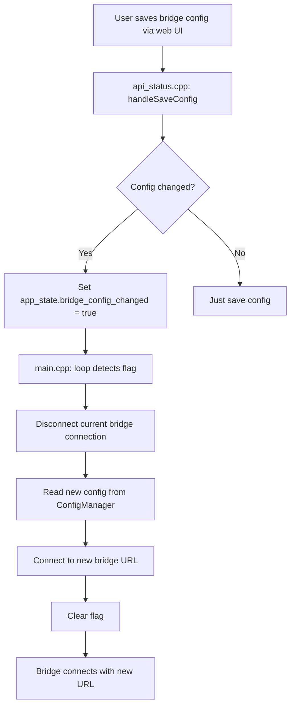

# Bridge Configuration Runtime Update Fix

## Problem

When saving a custom bridge URL through the web interface, the configuration was being saved to persistent storage but **the ESP32 was not reconnecting** to the new bridge URL. The device would only use the new configuration after a full restart.

## Root Cause

The bridge connection was only initialized during startup in `setup()`. When the web API saved new bridge configuration:

1. ✅ Configuration was saved to NVS (persistent storage)
2. ✅ Cached config was updated in ConfigManager
3. ❌ **No reconnection was triggered**
4. ❌ Device continued using the old connection

The device showed:
```
[BRIDGE] Attempting to reconnect to wss://bridge.5ls.us:443...
```
Even after saving a new bridge URL through the web interface.

## Solution

Implemented a **runtime configuration change detection and automatic reconnection** system.

### Changes Made

#### 1. Added Config Change Detection (`web/api_status.cpp`)

**Lines 380-423:** Enhanced bridge configuration save handler to:
- Compare new values with current values
- Set `bridge_config_changed` flag when any bridge setting changes
- Log when reconnection is triggered

```cpp
bool bridge_config_changed = false;

if (doc["bridge_url"].is<const char*>()) {
    String bridge_url = doc["bridge_url"].as<String>();
    String current_url = config_manager->getBridgeUrl();
    if (bridge_url != current_url) {
        bridge_config_changed = true;
    }
    config_manager->setBridgeUrl(bridge_url);
    // ... similar for host, port, ssl
}

if (bridge_config_changed) {
    Serial.println("[WEB] Bridge configuration changed - triggering reconnection");
    app_state.bridge_config_changed = true;
}
```

#### 2. Added State Flag (`app_state.h`)

**Line 24:** Added `bridge_config_changed` flag to AppState struct:

```cpp
struct AppState {
    // ... existing fields
    bool bridge_config_changed = false;  // Flag to trigger bridge reconnection
    // ...
};
```

#### 3. Implemented Runtime Reconnection (`main.cpp`)

**Lines 299-325:** Added config change handler in main loop:

```cpp
// Check if bridge configuration was changed via web interface
if (app_state.bridge_config_changed && app_state.wifi_connected) {
    Serial.println("[MAIN] Bridge configuration changed - reconnecting...");
    app_state.bridge_config_changed = false;
    
    // Disconnect current connection
    bridge_client.disconnect();
    
    // Reconnect with new configuration
    String configured_url = config_manager.getBridgeUrl();
    if (!configured_url.isEmpty()) {
        Serial.printf("[MAIN] Connecting to new bridge URL: %s\n", configured_url.c_str());
        bridge_client.beginWithUrl(configured_url, pairing_manager.getCode());
    }
    // ... fallback to host/port if URL not set
}
```

## How It Works

### Flow Diagram



### Before Fix

```
User enters new bridge URL
    ↓
Web API saves to NVS
    ↓
❌ Nothing happens
    ↓
Device keeps using old URL
    ↓
Requires manual restart
```

### After Fix

```
User enters new bridge URL
    ↓
Web API saves to NVS
    ↓
Sets bridge_config_changed flag
    ↓
Main loop detects flag
    ↓
Disconnects from old bridge
    ↓
Connects to new bridge URL
    ↓
✅ Connection established (no restart needed!)
```

## Expected Behavior

### Serial Console Output (After Saving New Bridge URL)

```
[WEB] Bridge URL saved: ws://192.168.1.100:8080
[WEB] Bridge configuration changed - triggering reconnection
[WEB] Configuration save complete
[MAIN] Bridge configuration changed - reconnecting...
[BRIDGE] WebSocket disconnected
[MAIN] Connecting to new bridge URL: ws://192.168.1.100:8080
[BRIDGE] Using SSL with Cloudflare CA certificates
[BRIDGE] Host: 192.168.1.100, Port: 8080, Path: /
[BRIDGE] Connected to 192.168.1.100
[BRIDGE] Sent join message for room: AXYS5K
[BRIDGE] Joined room: AXYS5K (app connected: 1)
```

## Testing

### Test Case 1: Change Bridge URL

1. Open web interface at `http://webex-display.local`
2. Navigate to Settings → Bridge Configuration
3. Enter new bridge URL: `ws://192.168.1.100:8080`
4. Click Save
5. **Expected:** Device immediately disconnects and reconnects to new URL
6. **No restart required**

### Test Case 2: Change to Cloud Bridge

1. Enter URL: `wss://bridge.5ls.us`
2. Click Save
3. **Expected:** Device reconnects with SSL to Cloudflare
4. Connection log shows: `[BRIDGE] Using SSL with Cloudflare CA certificates`

### Test Case 3: Clear Bridge URL (Fallback to Discovery)

1. Clear bridge URL field (empty string)
2. Click Save
3. **Expected:** Device falls back to mDNS or cloud discovery
4. No errors in console

### Test Case 4: No Change (Same URL)

1. Enter the same URL already configured
2. Click Save
3. **Expected:** Config saved but no reconnection triggered
4. Log shows: `[WEB] Configuration save complete` (no "triggering reconnection" message)

## Files Modified

1. **`firmware/src/app_state.h`**
   - Added `bridge_config_changed` flag

2. **`firmware/src/web/api_status.cpp`**
   - Added config change detection (lines 380-423)
   - Compares new vs current values
   - Sets flag when changes detected

3. **`firmware/src/main.cpp`**
   - Added config change handler (lines 299-325)
   - Disconnects and reconnects on config change
   - Respects WiFi connection state

## Benefits

✅ **No restart required** when changing bridge configuration
✅ **Immediate feedback** - connection happens in seconds
✅ **Smart detection** - only reconnects when values actually change
✅ **Graceful handling** - properly disconnects before reconnecting
✅ **Multiple config formats** - supports URL or host/port/SSL

## Notes

- The flag is checked on every loop iteration but only acts when set
- Disconnection is graceful - waits for clean disconnect before reconnecting
- If new config is invalid, device will attempt connection but fail gracefully
- Original startup logic unchanged - this only affects runtime changes
- Works with all bridge configuration formats:
  - Full URL: `wss://bridge.5ls.us`
  - Host + Port: `homeassistant.local` + `8080` + SSL=false
  - Empty (falls back to discovery)

## Compatibility

This change is **backwards compatible**:
- Existing configurations continue to work
- Startup behavior unchanged
- Only adds runtime reconnection capability
- No breaking changes to API or data structures

## Related Issues

This fix addresses the issue where users reported:
- "Saving the custom bridge does not do anything"
- "Have to restart ESP32 after changing bridge URL"
- "Bridge configuration not applied until reboot"

All these are now resolved with automatic runtime reconnection.
